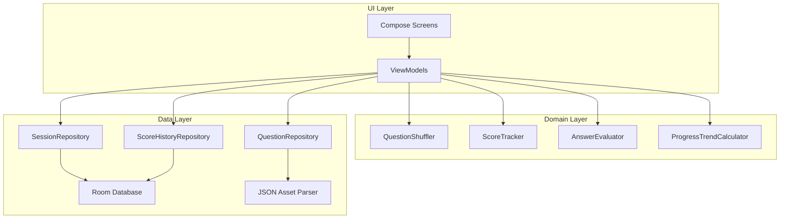

# Design Document

## Overview

This document defines the technical design for the AWS Exam Quiz App — a native Android application that helps users practice for the AWS Certified Developer Associate certification exam. The app operates entirely offline, loading questions from a bundled JSON file, presenting them in randomized order per session, persisting user progress locally, tracking scores, and maintaining a history of all completed session scores for progress tracking.

The application follows the MVVM (Model-View-ViewModel) architecture pattern commonly used in modern Android development with Kotlin and Jetpack Compose. Data persistence uses Android's Room database for session state and score history, while questions are loaded from a bundled JSON asset file.

## Architecture

### High-Level Architecture



### Architecture Pattern: MVVM with Clean Architecture Layers

- **UI Layer**: Jetpack Compose screens and ViewModels handling UI state
- **Domain Layer**: Pure business logic (shuffling, scoring, answer evaluation, progress trend calculation)
- **Data Layer**: Repositories abstracting data sources (Room DB, JSON assets)

### Technology Stack

| Component | Technology |
|-----------|-----------|
| Language | Kotlin |
| UI Framework | Jetpack Compose |
| Architecture | MVVM + Repository Pattern |
| Navigation | Jetpack Navigation Compose |
| DI | Hilt |
| Persistence | Room (sessions + score history), JSON assets (questions) |
| JSON Parsing | kotlinx.serialization |
| Testing | JUnit 5, Kotest (property-based), Turbine (flows) |
| Min SDK | 26 (Android 8.0) |

## Components and Interfaces

### 1. Question Repository

Responsible for loading and validating questions from the bundled JSON asset file.

```kotlin
interface QuestionRepository {
    suspend fun loadQuestions(): Result<List<Question>>
}
```

- Parses the JSON file on app startup
- Skips invalid entries and logs warnings
- Returns an error if the file is missing or entirely unparseable
- Caches parsed questions in memory after first load

### 2. Question Shuffler

Produces a randomized permutation of question indices for each new session.

```kotlin
interface QuestionShuffler {
    fun shuffle(questionCount: Int): List<Int>
}
```

- Uses `kotlin.random.Random` with a time-based seed
- Produces a permutation containing each index exactly once
- Stateless — receives count, returns shuffled index list

### 3. Session Repository

Manages session persistence using Room database.

```kotlin
interface SessionRepository {
    suspend fun saveSession(session: Session): Result<Unit>
    suspend fun loadIncompleteSession(): Result<Session?>
    suspend fun deleteSession(sessionId: String): Result<Unit>
    suspend fun markSessionCompleted(sessionId: String): Result<Unit>
}
```

- Persists session state synchronously after each answer submission
- Handles corruption by returning a failure result (caller discards and shows error)
- Stores shuffled order, answers given, current index, and completion status

### 4. Score History Repository

Manages persistence and retrieval of completed session scores.

```kotlin
interface ScoreHistoryRepository {
    suspend fun saveScore(scoreRecord: ScoreHistoryRecord): Result<Unit>
    suspend fun getAllScores(): Result<List<ScoreHistoryRecord>>
    suspend fun getRecentScores(count: Int): Result<List<ScoreHistoryRecord>>
}
```

- Persists a history record when a session is completed
- Returns scores ordered by completion date (most recent first)
- `getRecentScores` retrieves the last N scores for trend calculation

### 5. Answer Evaluator

Pure function that evaluates answer correctness.

```kotlin
object AnswerEvaluator {
    fun evaluate(question: Question, selectedOptions: Set<Int>): AnswerResult
}
```

- For single-answer: correct if the single selected option matches the correct answer
- For multi-answer: correct only if selected options exactly match the full correct answer set
- Returns `AnswerResult` containing correctness flag and details for feedback display

### 6. Score Tracker

Calculates and formats score information at session completion.

```kotlin
object ScoreTracker {
    fun calculateScore(answers: List<AnswerResult>, totalQuestions: Int): ScoreResult
}
```

- Counts correct answers
- Computes percentage rounded to nearest whole number
- Determines pass/fail using 72% threshold

### 7. Progress Trend Calculator

Pure function that determines whether the user's scores are improving, declining, or stable.

```kotlin
object ProgressTrendCalculator {
    fun calculateTrend(recentScores: List<Int>): ProgressTrend
}

enum class ProgressTrend {
    IMPROVING,
    DECLINING,
    STABLE
}
```

- Accepts the most recent scores (up to 5) ordered chronologically (oldest first)
- Requires at least 2 scores to compute a trend; returns STABLE if fewer than 2
- **Algorithm**: Computes the linear regression slope over the score percentages. If slope > threshold (+2), trend is IMPROVING. If slope < -threshold (-2), trend is DECLINING. Otherwise, STABLE.
- The threshold of ±2 percentage points per session prevents minor fluctuations from showing a false trend

### 8. ViewModels

**QuizViewModel**: Manages quiz session state — current question, navigation, answer submission, score display. On session completion, triggers score history persistence.

**HomeViewModel**: Manages app entry — checks for incomplete sessions, handles new session / resume flow.

**HistoryViewModel**: Manages score history state — loads all completed scores, computes progress trend, exposes UI state.

### 9. UI Screens

| Screen | Purpose |
|--------|---------|
| HomeScreen | Entry point — new session / resume / view history options |
| QuizScreen | Question display, option selection, submission |
| ResultScreen | Score summary with pass/fail indicator |
| HistoryScreen | List of past session scores with progress trend indicator |
| ErrorScreen | Error states (missing questions, corrupt session) |

## Data Models

### Question

```kotlin
@Serializable
data class Question(
    val id: Int,
    val text: String,
    val options: List<String>,
    val correctAnswers: Set<Int>,  // indices into options list
    val explanation: String
) {
    val isSingleAnswer: Boolean get() = correctAnswers.size == 1
    val isMultipleAnswer: Boolean get() = correctAnswers.size > 1
}
```

### Session

```kotlin
data class Session(
    val id: String,
    val questionOrder: List<Int>,   // shuffled indices into question bank
    val currentIndex: Int,
    val answers: Map<Int, AnswerRecord>,  // questionIndex -> answer
    val isCompleted: Boolean,
    val createdAt: Long
)
```

### AnswerRecord

```kotlin
data class AnswerRecord(
    val selectedOptions: Set<Int>,
    val isCorrect: Boolean
)
```

### AnswerResult

```kotlin
data class AnswerResult(
    val isCorrect: Boolean,
    val selectedOptions: Set<Int>,
    val correctOptions: Set<Int>
)
```

### ScoreResult

```kotlin
data class ScoreResult(
    val correctCount: Int,
    val totalCount: Int,
    val percentage: Int,           // rounded to nearest whole number
    val passed: Boolean            // percentage >= 72
)
```

### ScoreHistoryRecord

```kotlin
data class ScoreHistoryRecord(
    val id: String,
    val completionDate: Long,      // epoch millis
    val percentage: Int,           // rounded to nearest whole number
    val passed: Boolean            // percentage >= 72
)
```

### JSON Schema (Question Bank)

```json
{
  "questions": [
    {
      "id": 1,
      "text": "Which AWS service provides a fully managed NoSQL database?",
      "options": [
        "Amazon RDS",
        "Amazon DynamoDB",
        "Amazon Redshift",
        "Amazon Aurora"
      ],
      "correctAnswers": [1],
      "explanation": "DynamoDB is AWS's fully managed NoSQL database service..."
    }
  ]
}
```

### Room Entity (Session Persistence)

```kotlin
@Entity(tableName = "sessions")
data class SessionEntity(
    @PrimaryKey val id: String,
    val questionOrderJson: String,   // serialized List<Int>
    val currentIndex: Int,
    val answersJson: String,         // serialized Map<Int, AnswerRecord>
    val isCompleted: Boolean,
    val createdAt: Long
)
```

### Room Entity (Score History)

```kotlin
@Entity(tableName = "score_history")
data class ScoreHistoryEntity(
    @PrimaryKey val id: String,
    val completionDate: Long,
    val percentage: Int,
    val passed: Boolean
)
```

### Room Database

```kotlin
@Database(
    entities = [SessionEntity::class, ScoreHistoryEntity::class],
    version = 2
)
abstract class AppDatabase : RoomDatabase() {
    abstract fun sessionDao(): SessionDao
    abstract fun scoreHistoryDao(): ScoreHistoryDao
}
```

### DAOs

```kotlin
@Dao
interface SessionDao {
    @Insert(onConflict = OnConflictStrategy.REPLACE)
    suspend fun upsertSession(session: SessionEntity)

    @Query("SELECT * FROM sessions WHERE isCompleted = 0 LIMIT 1")
    suspend fun getIncompleteSession(): SessionEntity?

    @Query("DELETE FROM sessions WHERE id = :sessionId")
    suspend fun deleteSession(sessionId: String)
}

@Dao
interface ScoreHistoryDao {
    @Insert
    suspend fun insertScore(score: ScoreHistoryEntity)

    @Query("SELECT * FROM score_history ORDER BY completionDate DESC")
    suspend fun getAllScores(): List<ScoreHistoryEntity>

    @Query("SELECT * FROM score_history ORDER BY completionDate DESC LIMIT :count")
    suspend fun getRecentScores(count: Int): List<ScoreHistoryEntity>
}
```


## Correctness Properties

*A property is a characteristic or behavior that should hold true across all valid executions of a system — essentially, a formal statement about what the system should do. Properties serve as the bridge between human-readable specifications and machine-verifiable correctness guarantees.*

### Property 1: Answer Evaluation Correctness

*For any* Question (single-answer or multiple-answer) and *for any* set of selected option indices, the AnswerEvaluator SHALL return `isCorrect = true` if and only if the set of selected options is exactly equal to the set of correct answers defined for that Question.

**Validates: Requirements 2.1, 2.2**

### Property 2: Shuffle Permutation Invariant

*For any* question count n ≥ 2, the QuestionShuffler SHALL produce a list of length n where sorting the output yields the sequence [0, 1, 2, ..., n-1], ensuring every question appears exactly once and no question is omitted. A new Session created from this shuffle SHALL have currentIndex = 0 and an empty answers map.

**Validates: Requirements 3.1, 8.1**

### Property 3: Shuffle Non-Determinism

*For any* question count n ≥ 5, two consecutive calls to QuestionShuffler SHALL produce different orderings (with overwhelming probability across 100+ test iterations, this validates the ≥99% probability requirement).

**Validates: Requirements 3.2**

### Property 4: Session Persistence Round-Trip

*For any* valid Session object (with arbitrary questionOrder, currentIndex, answers map, and completion status), saving the session to the SessionRepository and loading it back SHALL produce a Session with identical questionOrder, identical answers map, identical currentIndex, and identical completion status.

**Validates: Requirements 3.3, 4.1, 4.3**

### Property 5: Session Completion Detection

*For any* Session where the number of entries in the answers map equals the length of the questionOrder list, the session SHALL be marked as completed. For any Session where the answers count is less than the questionOrder length, the session SHALL NOT be marked as completed.

**Validates: Requirements 4.4**

### Property 6: Score Calculation Correctness

*For any* list of AnswerResult objects and a total question count, the ScoreTracker SHALL compute: (a) correctCount equal to the number of results where isCorrect is true, (b) percentage equal to round(correctCount / totalCount × 100) to the nearest whole number, and (c) passed equal to true if and only if percentage ≥ 72.

**Validates: Requirements 5.1, 5.2, 5.3**

### Property 7: Navigation Button Visibility

*For any* currentIndex and totalCount where 0 ≤ currentIndex < totalCount, the previous button SHALL be visible if and only if currentIndex > 0, and the next button SHALL be visible if and only if currentIndex < totalCount - 1.

**Validates: Requirements 6.1, 6.2**

### Property 8: Parser Resilience

*For any* list of JSON entries composed of a mix of valid Question entries and invalid entries (missing fields, malformed values), the QuestionRepository parser SHALL return exactly the valid entries in their original relative order, skipping all invalid entries without failing.

**Validates: Requirements 7.3**

### Property 9: Question Serialization Round-Trip

*For any* valid Question object, serializing it to JSON and parsing it back SHALL produce an equivalent Question with identical text, identical options in the same order, identical correctAnswers set, and identical explanation text.

**Validates: Requirements 7.5**

### Property 10: Multi-Answer Count Indicator

*For any* Multiple_Answer_Question, the displayed prompt SHALL include the number of correct answers expected, and this number SHALL equal the size of the correctAnswers set defined for that Question.

**Validates: Requirements 1.4**

### Property 11: Score History Persistence Round-Trip

*For any* valid ScoreHistoryRecord (with arbitrary completion date, percentage score, and pass/fail status), saving the record to the ScoreHistoryRepository and loading it back SHALL produce a record with identical completionDate, identical percentage, and identical passed flag.

**Validates: Requirements 9.1**

### Property 12: Score History Ordering

*For any* set of ScoreHistoryRecords with distinct completion dates, the ScoreHistoryRepository SHALL return them ordered by completionDate descending (most recent first), and the returned list SHALL contain every record that was saved.

**Validates: Requirements 9.2**

### Property 13: Progress Trend Calculation

*For any* list of 2 to 5 integer percentage scores (each between 0 and 100), the ProgressTrendCalculator SHALL return IMPROVING if the linear regression slope exceeds +2, DECLINING if the slope is below -2, and STABLE otherwise. For any list with fewer than 2 scores, it SHALL return STABLE.

**Validates: Requirements 9.3**

## Error Handling

### Error Categories

| Error | Cause | Recovery |
|-------|-------|----------|
| Question file missing | JSON asset not bundled or inaccessible | Show error screen, prevent session creation |
| Question file unparseable | Entirely malformed JSON | Show error screen, prevent session creation |
| Invalid question entry | Missing/malformed fields in individual entry | Skip entry, log warning, continue parsing |
| Insufficient questions | Fewer than 2 valid questions after parsing | Show error message, prevent session creation |
| Session corruption | Stored session data unreadable | Discard session, show recovery error, allow new session |
| Session save failure | Room DB write fails | Retry once, then show error to user |
| Score history save failure | Room DB write fails when saving score record | Log error, show toast notification, session result still displayed |
| Score history read failure | Room DB read fails when loading history | Show error message on history screen, allow retry |

### Error Handling Strategy

1. **Fail fast at boundaries**: Validate data at parse time (JSON questions) and persist time (session state, score history). Invalid data never propagates into domain logic.

2. **Graceful degradation**: Individual invalid question entries are skipped rather than failing the entire load. The app functions with whatever valid questions remain (minimum 2). Score history failures do not affect quiz functionality.

3. **User-facing errors**: All error states that prevent normal operation show a clear message explaining what happened and what the user can do (typically: start a new session).

4. **Sealed Result types**: All repository methods return `Result<T>` to force callers to handle success and failure paths explicitly.

```kotlin
sealed class AppError {
    data class QuestionLoadError(val message: String) : AppError()
    data class SessionCorruptionError(val message: String) : AppError()
    data class InsufficientQuestionsError(val available: Int) : AppError()
    data class ScoreHistoryError(val message: String) : AppError()
}
```

## Testing Strategy

### Testing Approach

This project uses a dual testing strategy combining property-based tests for universal correctness guarantees with example-based unit tests for specific scenarios and edge cases.

### Property-Based Testing

**Library**: [Kotest Property Testing](https://kotest.io/docs/proptest/property-based-testing.html) — the standard PBT library for Kotlin.

**Configuration**:
- Minimum 100 iterations per property test
- Each test tagged with the corresponding design property reference
- Tag format: `Feature: aws-exam-quiz-app, Property {N}: {title}`

**Properties to implement**:

| Property | Component Under Test | Generator Strategy |
|----------|---------------------|-------------------|
| 1: Answer Evaluation | AnswerEvaluator | Random questions (2-6 options, 1-3 correct), random selections |
| 2: Shuffle Permutation | QuestionShuffler | Random counts 2..500 |
| 3: Shuffle Non-Determinism | QuestionShuffler | Random counts 5..500 |
| 4: Session Round-Trip | SessionRepository | Random sessions with varying progress |
| 5: Session Completion | Session logic | Random sessions with answers count == or < total |
| 6: Score Calculation | ScoreTracker | Random answer result lists (0..200 items) |
| 7: Navigation Visibility | Navigation logic | Random index/total pairs |
| 8: Parser Resilience | QuestionRepository | Mixed valid/invalid JSON entries |
| 9: Serialization Round-Trip | Question serialization | Random valid Question objects |
| 10: Multi-Answer Count | Prompt formatting | Random multi-answer questions |
| 11: Score History Round-Trip | ScoreHistoryRepository | Random ScoreHistoryRecord objects (dates, percentages 0-100, pass/fail) |
| 12: Score History Ordering | ScoreHistoryRepository | Random sets of records with distinct dates |
| 13: Progress Trend | ProgressTrendCalculator | Random lists of 0-5 percentage scores (0-100) |

### Unit Tests (Example-Based)

Focus areas:
- UI state initialization (criteria 1.2, 1.3, 2.3-2.7)
- Navigation state for answered vs unanswered questions (6.3, 6.4)
- Session resume/new session flow (4.2, 8.2, 8.3, 8.4)
- Progress display formatting (5.4)
- Empty score history display (9.4)
- ProgressTrendCalculator edge cases: exactly 2 scores, all identical scores, monotonically increasing/decreasing

### Edge Case Tests

- Question bank with 0 questions (3.4)
- Question bank with 1 question (3.4)
- Corrupted session data (4.5)
- Completely missing/unparseable JSON file (7.4)
- Session where user answered all questions correctly (100% score)
- Session where user answered all questions incorrectly (0% score)
- Score exactly at 72% threshold boundary
- Score history with exactly 1 entry (no trend displayed)
- Score history with exactly 2 entries (minimum for trend calculation)
- All 5 recent scores identical (STABLE trend)
- Trend calculation with scores [0, 100, 0, 100, 0] (oscillating — should be STABLE)

### Integration Tests

- JSON file load timing (< 3 seconds requirement, 7.2)
- Full session lifecycle: create → answer questions → complete → view results → verify history record persisted
- Room database round-trip with actual Android instrumented test (both sessions and score history tables)
- Score history accumulation: complete multiple sessions, verify history grows and ordering is correct

### Test Organization

```
app/src/test/           # Unit + property tests (JVM)
├── domain/
│   ├── AnswerEvaluatorPropertyTest.kt
│   ├── ScoreTrackerPropertyTest.kt
│   ├── QuestionShufflerPropertyTest.kt
│   ├── NavigationLogicPropertyTest.kt
│   └── ProgressTrendCalculatorPropertyTest.kt
├── data/
│   ├── QuestionParserPropertyTest.kt
│   ├── QuestionSerializationPropertyTest.kt
│   ├── SessionPersistencePropertyTest.kt
│   └── ScoreHistoryPersistencePropertyTest.kt
└── ui/
    ├── QuizViewModelTest.kt
    └── HistoryViewModelTest.kt

app/src/androidTest/    # Instrumented tests
├── SessionDatabaseTest.kt
├── ScoreHistoryDatabaseTest.kt
└── QuestionLoadPerformanceTest.kt
```
